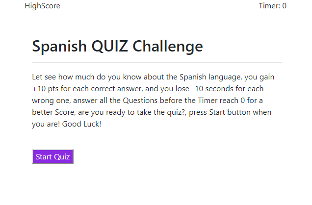
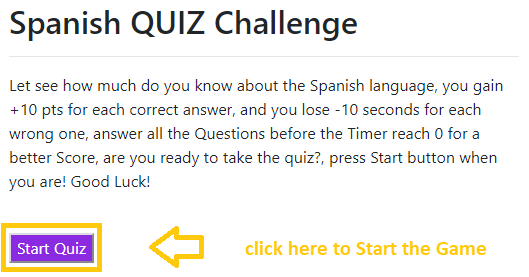
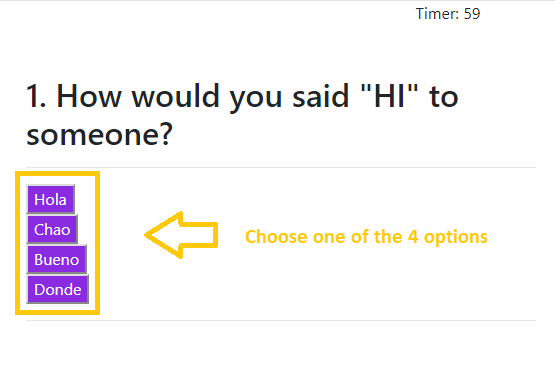
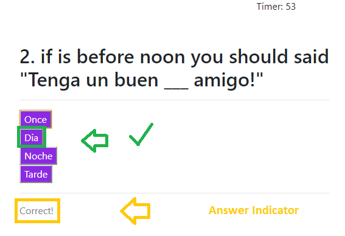
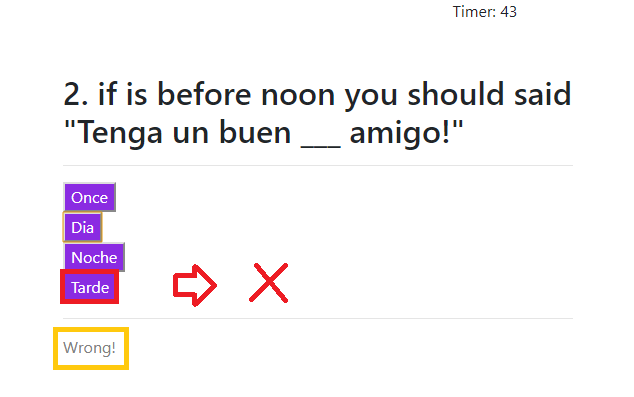
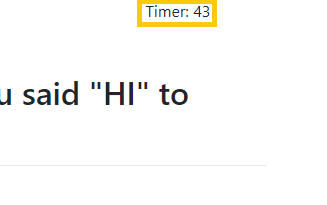
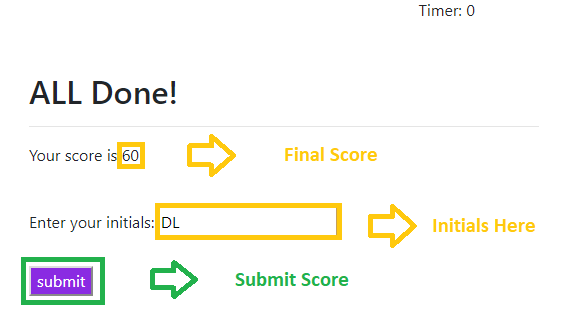
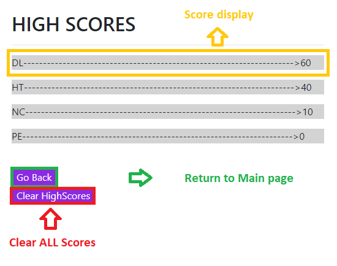

# homework4
Name

"Web APIs, Spanish Challenge QUIZ".

instruction 
(Hold "Ctrl" key while you click on image "sample.png" to visualize)

  step 1

  

  -Open URL at the end of this ReadMe file, (recomended Browser: Google Chrome).

  step 2

  

  -Game instructions:
    - Multiple choice Quiz (4 options each question).
    - +10 points for a Correct answer.
    - -10 seconds for a Wrong answer.
    - Quiz starts with timer at 60 seconds.
    - Answer All the Question before you run out of time for a better "Score".
    - Click on "start" button to start the Quiz.

  step 3

   -Playing the Quiz.

   

   -Choose one of the Multiple Choice answers.

   -Correct Answer.

   

   -Correct answer will add +10 point to your Score.

   -Wrong Answer.

   

   -Wrong answer will give you a penalty of -10 seconds on the timer.

   -Timer.

   

   -Pay Attention to the timer while you are playing.

  step 4

  Submit Score.

  

  -When you finish the Quiz (either you finish all Questions or you Run-out of time), Submit your Initials inside the input box
  to keep record of your Scores.

  step 5

  HighScores Board

  

  -After Submiting your Initials the HighScore Board will display, so you can see your peers Scores.
  -You can also try again clicking on "go Back Button" and then when you are on the main page clicking again on "start" button.
  -If you like, you can also clear the HighScore Board clicking on "CLean HighScore".
  -You can access to the HighScore Board also from main page.

  
Description

Timed code quiz with multiple-choice questions. This app will run in the browser and feature dynamically updated HTML and CSS powered by JavaScript code. It also feature a clean and polished user interface and is responsive, ensuring that it adapts to multiple screen sizes.
like: CellPhones "640px", Tablets "768px", and Laptops "980px".

Details

This repository content the html files: index "main page", the CSS styles "style.css", the JavaScript "script.js" and a "image" folder with the captures for this Readme File.

URL 

The URL to open the page on your Browser is "https://diegolehyt.github.io/homework4/"